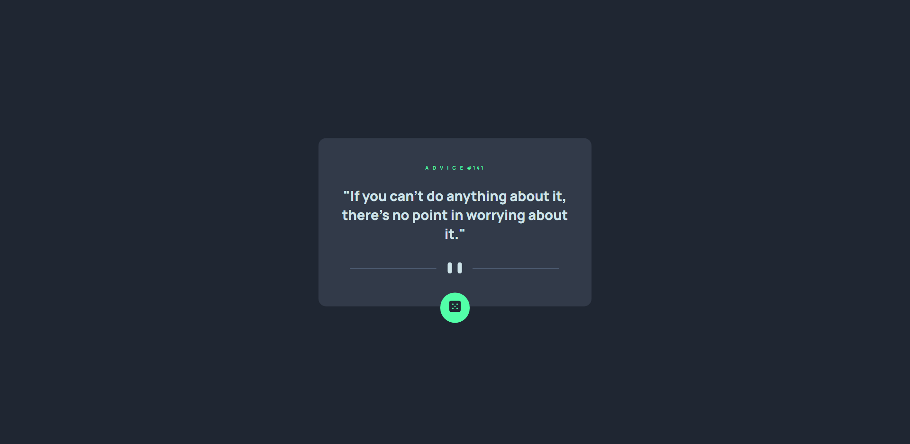

Preview.




## Table of contents

- [Overview](#overview)
  - [Links](#links)
- [My process](#my-process)
  - [Built with](#built-with)
  - [What I learned](#what-i-learned)
- [Author](#author)

## Overview

I liked this project, overall I enjoy using apis.

### Links

- Solution URL: [Click me!]()
- Live Site URL: [Click me!](https://johnhaab.github.io/advice-generator-app-master)

## My process

First I started with adding what I need in index.html to get everything working, then I started my styles.css, and last I added my index.js code.

### Built with

- Semantic HTML5 markup
- JavaScript
- CSS custom properties
- Advice Slip API

### What I learned

I learned about Javascript API https interactions.

Code snippets, see below:

```javascript
const inputEmail = document.getElementById
("input");
const submitBtn = document.getElementById
("btn");
const form = document.getElementById
("form");

submitBtn.addEventListener("click", (e) => {
    e.preventDefault();
    const regEx = /^\w+([\.-]?\w+)*@\w+([\.-]?\w+)*(\.\w{2,3})+$/;

    if (inputEmail.value.match(regEx)) {
        console.log("valid");
        form.classList.remove("error");
    }else{
        console.log("error");
        form.classList.add("error");
    }
})
```

## Author

- Frontend Mentor - [@johnhaab](https://www.frontendmentor.io/profile/johnhaab)
- Twitter - [@johnlhaab](https://www.twitter.com/johnlhaab)
